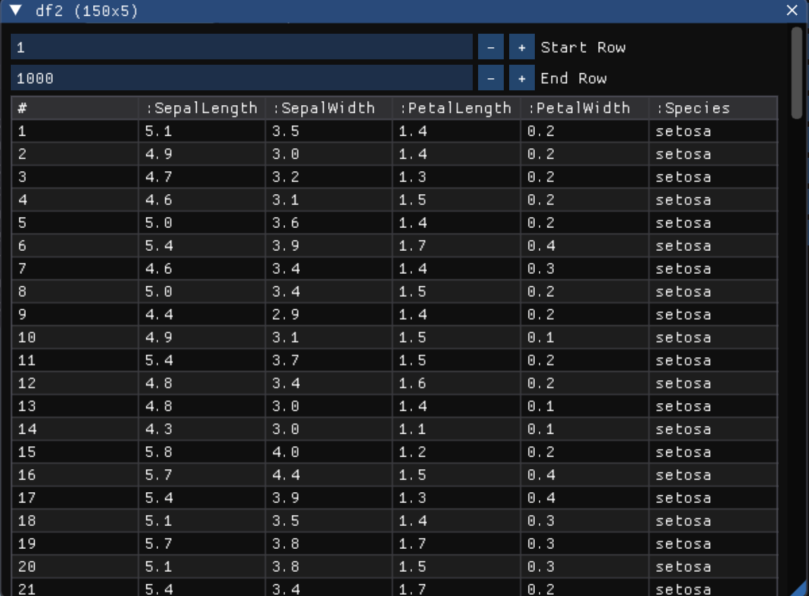

# Browse.jl



Julia package that provides visualizations of [Tables.jl](https://github.com/JuliaData/Tables.jl)-compatible tabular data. Under the hood, it uses the immediate mode GUI [Dear ImGui](https://github.com/ocornut/imgui) (via [CImGui.jl](https://github.com/Gnimuc/CImGui.jl)), meaning that the visualizations will update when the underlying data changes.

Very much in alpha stage.

Reminder: this software is provided as-is, without any sorts of guarantees or implicit promises of support. See the [license](LICENSE.md) for details. If you want features or bug fixes, you can file an issue and hope that someone resolves it, or you can roll up your sleeves and do it yourself. 

## Installation

Browse.jl is not registered. To install, type in the Julia REPL:
```
    ] add https://github.com/jmboehm/Browse.jl
```

## Example

```julia

using Revise, RDatasets, DataFrames
using Browse

using CImGui
using CImGui.CSyntax
using CImGui.CSyntax.CStatic

Browse.init()

df_iris = dataset("datasets", "iris")
Browse.@browse df_iris

```

## Related Packages

- [TableView.jl](https://github.com/JuliaComputing/TableView.jl): ag-grid based table viewer built on WebIO.jl, supports lazy loading.
- [FloatingTableView.jl](https://github.com/pdeffebach/FloatingTableView.jl): the same as TableView.jl, but with a [Blink.jl]() window 
- [BrowseTables.jl](https://github.com/tpapp/BrowseTables.jl) outputs tables as HTML, to be used with whatever you may want to use to render HTML.